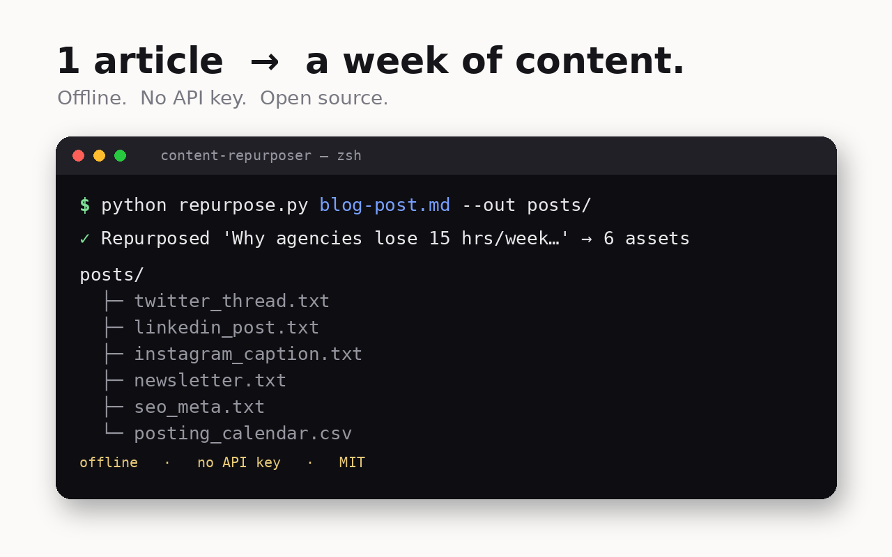

# Content Repurposer (free tool)

    

Turn **one** long-form piece — a blog post, a webinar transcript, a voice-note dump —
into a **week of platform-ready content** in seconds.

Built for marketing & content agencies drowning in "turn this into social posts" work.



## What it generates from one input
- 🧵 X/Twitter thread (auto-split to tweet length, numbered)
- 💼 LinkedIn post (hook → key points → CTA)
- 📸 Instagram caption + hashtags
- ✉️ Newsletter blurb
- 🔎 SEO title + meta description (length-checked)
- 🗓️ 7-day posting calendar (CSV)

## Why it's different
- **Runs 100% offline** — no API key, no signup, your content never leaves your machine.
- One command. Drop in a `.md` or `.txt`, get a folder of assets.
- Optional `--llm` mode upgrades the quality using Anthropic's API if you set `ANTHROPIC_API_KEY`.

## Usage
```bash
python repurpose.py your_article.md --out output_folder
# optional higher-quality rewrite (needs ANTHROPIC_API_KEY):
python repurpose.py your_article.md --out output_folder --llm
```
Requires Python 3.9+. No dependencies for offline mode. (`pip install anthropic` only if using `--llm`.)

## Try it
```bash
python repurpose.py sample_input.md --out demo
```

---
### Want this fully automated for your agency?
This free version is the manual, single-file tool. The done-for-you version plugs into
your CMS + scheduler, learns each client's brand voice, and runs every time you publish —
zero copy-paste. Reply / DM **"repurpose"** and I'll show you a 2-min walkthrough.

— Modu Company · moducompanyofficial@gmail.com
